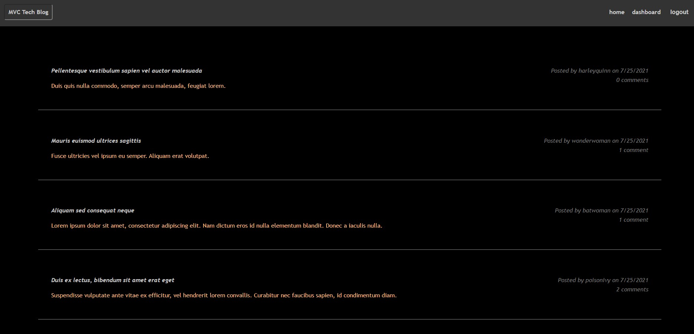
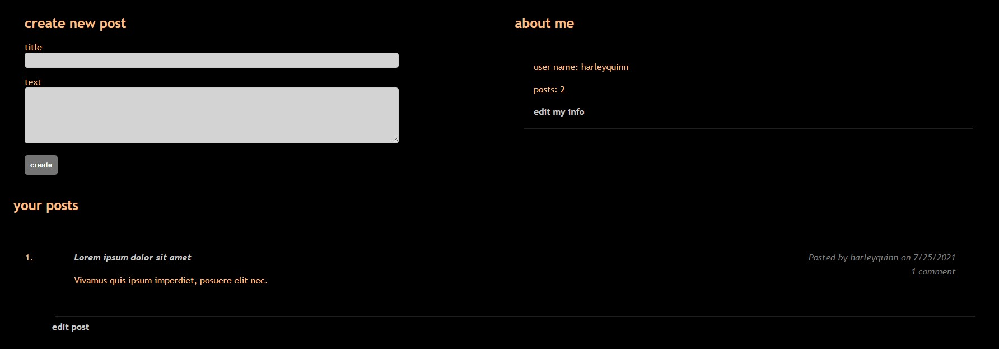

# MVC-tech-blog

## License
  

## Description
A CMS-style blog site where developers can publish their blog posts and comment on other posts.

Deployed application: https://mvc-tech-blog923874.herokuapp.com/

## Screenshots
### Homepage

### Dashboard

## Table of Contents
  * [Installation](#installation)
  * [Usage](#usage)
  * [Contributing](#contributing)
  * [Questions](#questions)
        
## Installation
Enter `npm install` in the terminal to install the necessary dependencies.
   
## Usage
- Enter `node server.js` or `npm start` to connect to the localhost.
- Enter `http://localhost:3001/` in the address bar to use application.

## Contributing
Charity Rogers

## Questions
If you have any questions or concerns, please contact me!

  - GitHub: https://github.com/rogerscl116
  - Email: rogerscl116@gmail.com 
